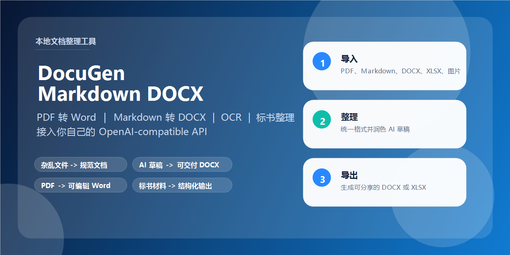

# DocuGen Markdown DOCX

[简体中文](./README.md) | **English**

<p align="center">
  <a href="https://github.com/dragon43ppp/docugen-markdown-docx/stargazers"></a>
  <a href="https://github.com/dragon43ppp/docugen-markdown-docx/blob/main/LICENSE"></a>
  <a href="https://github.com/dragon43ppp/docugen-markdown-docx/commits/main"></a>
</p>

<p align="center">
  
</p>

<p align="center">
  <strong>PDF to Word</strong> · <strong>Markdown to DOCX</strong> · <strong>Messy files to clean deliverables</strong>
</p>

DocuGen Markdown DOCX is a local document cleanup tool. You can import `TXT / Markdown / DOCX / XLSX / PDF / images`, continue editing the extracted content in the app, and export the final result as Word or Excel.
It is suitable for `PDF to Word`, `Markdown to DOCX`, AI-generated draft cleanup, document normalization, and bid or tender document processing.

## Understand It in 3 Seconds

- Turn messy PDFs, Word files, Markdown drafts, and image documents into one clean deliverable
- Convert AI-generated Markdown into client-ready or internally shareable DOCX files
- Clean up, standardize, and export bid documents, tender responses, and proposal materials

This repository does not provide any hosted model service out of the box. After launch, enter your own:

- `API Base URL`
- `API Key`

to connect any OpenAI-compatible endpoint. If needed, you can also set a default model name.

## Quick Start

### 1. Clone the repository

```bash
git clone https://github.com/dragon43ppp/docugen-markdown-docx.git
cd docugen-markdown-docx
```

### 2. Start the project

Option A: one-click start on Windows

```bat
Start-DocuGen.bat
```

The script will automatically:

- install frontend dependencies
- create a local backend virtual environment at `.backend-venv`
- install backend dependencies
- start the backend at `http://127.0.0.1:8001`
- start the frontend at `http://127.0.0.1:9000`

Option B: start manually

Frontend:

```bash
npm install
npm run dev -- --host 127.0.0.1 --port 9000
```

Backend:

```bash
python -m venv .backend-venv
.backend-venv\Scripts\python -m pip install -r backend\requirements.txt
cd backend
..\.backend-venv\Scripts\python -m uvicorn main:app --host 127.0.0.1 --port 8001 --reload
```

### 3. First-run configuration

To get started, fill in at least:

- `API Base URL`
- `API Key`

Optional fields:

- `Default model`
- `Bid model`

These values are stored only in browser `localStorage`.

## Features

- Import `TXT / Markdown / DOCX / XLSX / PDF / images`
- Keep editing and previewing Markdown in the app
- Export an intermediate `PDF -> Word` result
- AI formatting, smart tables, and bid-document rewriting
- Export final `DOCX / XLSX`

## Use Cases

- Normalize messy files and inconsistent document formats into one clean, unified output
- Convert AI-generated Markdown drafts into Word or Excel files that are easier to circulate inside a company or send to clients
- Clean up, restructure, rewrite, and standardize bid documents, tender responses, and proposal materials

## Workflow

1. Import a PDF or another document
2. If the source is a PDF, click `Download Intermediate Word`
3. Continue refining the extracted content in the app
4. Export the final DOCX or Excel file

## Does PDF to Word require an LLM?

No.

The `PDF -> Word` step prefers the local offline structure pipeline. Your configured online endpoint is only used for:

- AI formatting
- Smart tables
- Bid-document rewriting

## Enable the offline PDF engine

If you want scanned-PDF OCR, layout analysis, table extraction, and direct `PDF -> DOCX` conversion, prepare a runnable `Offline_PDF_Structure` environment and set:

```powershell
$env:DOCUGEN_OFFLINE_PDF_ROOT="D:\BaiduNetdiskDownload\PDF图片表格数据提取\Offline_PDF_Structure"
```

You can also place a runnable offline bundle at:

```text
backend/offline_pdf_bundle
```

## Security Notes

- No real API key is included in this repository
- No default hosted endpoint is included
- The frontend only uses the `API Base URL` and `API Key` you enter
- The backend only allows HTTPS upstreams by default, or local HTTP addresses

## FAQ

### Do I need to provide my own model endpoint?

Yes. This repository does not ship with a hosted model service. You only need to enter your own `API Base URL` and `API Key`.

### Can I use OpenAI, Gemini, or Qwen?

Yes. Any endpoint that is compatible with the OpenAI-style API can be used here.

### Does PDF to Word always require an LLM?

No. `PDF -> Word` prefers the local offline structure pipeline. Only AI formatting, smart tables, and bid-document rewriting use your configured online endpoint.

### Who is this project for?

Teams or individuals who frequently clean up documents for internal reporting, customer delivery, proposals, tenders, or AI-generated drafts.

### Can I just clone and run it locally?

Yes. The repository already provides a direct:

```bash
git clone https://github.com/dragon43ppp/docugen-markdown-docx.git
cd docugen-markdown-docx
```

## License

MIT
